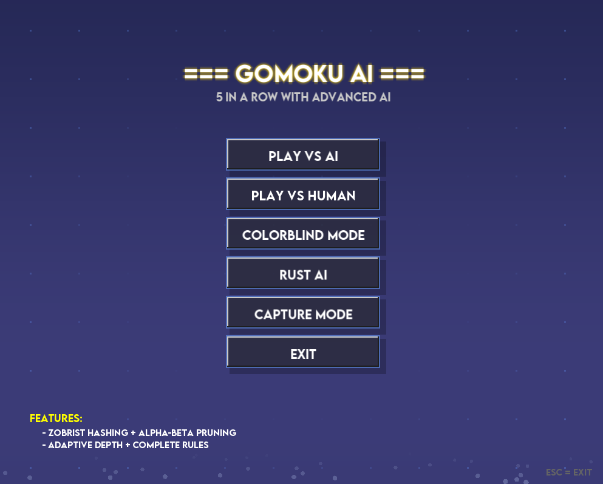
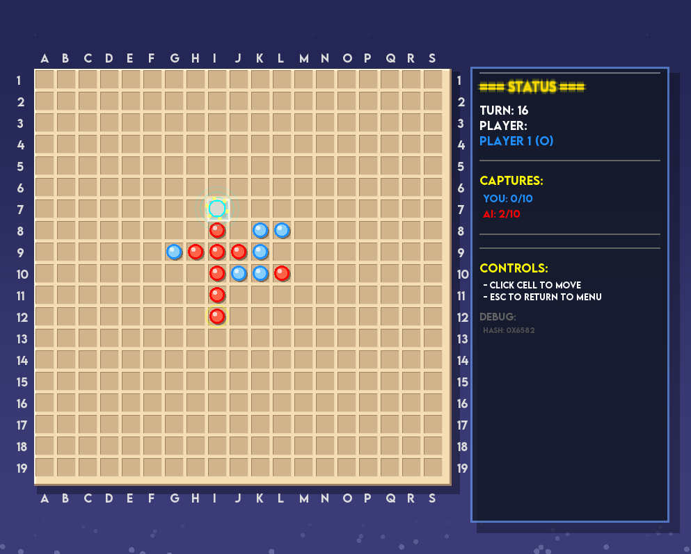

# 🎮 Gomoku (Five in a Row)

<div align="center">


**An advanced Gomoku (五目並べ) game with AI powered by hybrid C++/Rust implementation**

[Features](#-features) • [Installation](#-installation) • [Usage](#-usage) • [AI Architecture](#-ai-architecture) • [Project Structure](#-project-structure)

</div>

---

## 🖼️ Screenshots

<div align="center">

### Main Menu


### Gameplay


</div>

---

## 📋 Table of Contents

- [About](#-about)
- [Features](#-features)
- [Requirements](#-requirements)
- [Installation](#-installation)
- [Usage](#-usage)
- [AI Architecture](#-ai-architecture)
- [Project Structure](#-project-structure)
- [Technical Details](#-technical-details)
- [Performance](#-performance)
- [Contributing](#-contributing)

---

## 🎯 About

**Gomoku** (also known as Five in a Row or 五目並べ) is a strategic board game where two players take turns placing stones on a 19×19 board. The objective is to be the first to form an unbroken chain of five stones horizontally, vertically, or diagonally.

This implementation features:
- **Hybrid C++/Rust Architecture**: Core game logic in C++17, AI engine in Rust for maximum performance
- **Advanced AI**: Minimax with alpha-beta pruning, iterative deepening, and transposition tables
- **Beautiful GUI**: Built with SFML for smooth graphics and intuitive gameplay
- **Pro Rules Support**: Includes capture rules (10 captures = win) for advanced gameplay

---

## ✨ Features

### 🎨 **User Interface**
- ✅ Smooth SFML-based graphical interface
- ✅ Real-time move suggestions with scoring
- ✅ Visual feedback for valid/invalid moves
- ✅ Game state tracking (captures, turn count, AI stats)
- ✅ Clean, professional board design with readable coordinates
- ✅ Interactive menu system
- ✅ Real-time AI analysis display (nodes evaluated, cache hits)

### 🎵 **Audio System**
- ✅ Background music (looping main theme)
- ✅ Sound effects for:
  - Piece placement
  - Invalid moves
  - Menu clicks
  - Victory/Defeat
- ✅ Volume controls and mute functionality
- ✅ OGG format support via SFML Audio

### 🤖 **AI Engine**
- ✅ **Hybrid C++/Rust Implementation**: Core AI in Rust for maximum performance
- ✅ **Immediate Threat Detection**: 
  - Checks for AI winning moves before search
  - **Blocks opponent winning threats instantly**
  - Prevents obvious 5-in-a-row losses
- ✅ **Iterative Deepening Search**: Progressive depth searching for optimal time management
- ✅ **Alpha-Beta Pruning**: Efficient tree search with cutoffs
- ✅ **Transposition Table**: 64MB cache with Zobrist hashing
- ✅ **Sophisticated Move Ordering**: 
  - Previous best move prioritization
  - Geometric value evaluation
  - Threat detection and blocking
  - Capture opportunity analysis
- ✅ **Advanced Pattern Recognition**:
  - Detection of 2/3/4/5-in-a-row patterns
  - Gap pattern analysis (e.g., X-XXX, XX-X)
  - Free-end evaluation
  - Open and half-open pattern scoring
- ✅ **Mate Distance Calculation**: Prefers faster wins and slower losses
- ✅ **Adaptive Candidate Generation**: Smart move pruning based on game phase
- ✅ **In-Place Move Application**: Zero-copy state updates for performance
- ✅ **Capture Evaluation**: Context-aware scoring based on game progression

### 🎲 **Game Rules**
- ✅ Standard Gomoku (5-in-a-row wins)
- ✅ Pro rules with captures (capture 10 stones to win)
- ✅ 19×19 board (standard size)
- ✅ Move validation and illegal move prevention

---

## 📦 Requirements

### System Requirements
- **OS**: Linux (tested on Ubuntu 20.04+)
- **CPU**: Multi-core processor recommended
- **RAM**: 256MB minimum (for AI transposition table)

### Software Dependencies
- **C++ Compiler**: GCC 9+ or Clang 10+ (C++17 support required)
- **Rust**: 1.70 or newer
- **Cargo**: Latest version
- **SFML**: 2.5.1 or newer (Graphics, Window, System, **Audio** modules)
- **Make**: GNU Make 4.0+

### Development Tools (Optional)
- **Git**: For version control
- **Valgrind**: For memory leak detection
- **gdb/lldb**: For debugging

---

## 🚀 Installation

### 1. Clone the Repository
```bash
git clone https://github.com/Flingocho/gomoku.git
cd gomoku
```

### 2. Install SFML
#### Ubuntu/Debian:
```bash
sudo apt-get update
sudo apt-get install libsfml-dev
```

**Note**: This installs all SFML modules including Graphics, Window, System, and Audio.

#### macOS (Homebrew):
```bash
brew install sfml
```

#### Manual Installation:
Download SFML 2.5.1 from [SFML website](https://www.sfml-dev.org/download.php) and extract to `~/sfml-2.5.1/`

### 3. Install Rust
```bash
curl --proto '=https' --tlsv1.2 -sSf https://sh.rustup.rs | sh
source $HOME/.cargo/env
```

### 4. Build the Project
```bash
make
```

This will:
1. Build the Rust AI library (`gomoku_ai_rust`)
2. Compile C++ source files
3. Link everything into the final `gomoku` executable

---

## 🎮 Usage

### Running the Game
```bash
./gomoku
```

### Controls
- **Mouse Click**: Place a stone / Click menu buttons
- **ESC**: Quit game
- **Mouse Hover**: Preview move position and see suggestions

### Audio Controls
- **M Key**: Toggle mute
- Volume is set to comfortable levels by default

### Gameplay
1. Launch the game
2. Click on an empty intersection to place your stone (⚪)
3. AI will automatically respond with its move (⚫)
   - Watch AI stats (nodes evaluated, cache hits) in real-time
   - See move suggestions and scores
4. Continue until:
   - One player gets 5 in a row (horizontal, vertical, or diagonal)
   - One player captures 10 opponent stones
   - Board is full (draw)

### Game Feedback
- ✅ **Valid moves**: Play "place piece" sound
- ❌ **Invalid moves**: Play "invalid move" sound with visual feedback
- 🏆 **Victory**: Victory fanfare
- 💀 **Defeat**: Defeat sound

---

## 🧠 AI Architecture

The AI uses a sophisticated hybrid approach combining the strengths of C++ and Rust:

### Core Algorithm: Minimax with Alpha-Beta Pruning

```
┌─────────────────────────────────────────────────────────┐
│                 Pre-Search Checks                       │
│  1. Check for immediate AI winning moves                │
│  2. Check for opponent winning threats → BLOCK!         │
└────────────────────┬────────────────────────────────────┘
                     │
                     ▼
┌─────────────────────────────────────────────────────────┐
│                    Iterative Deepening                  │
│                     (depth 1 → max)                     │
└────────────────────┬────────────────────────────────────┘
                     │
                     ▼
┌─────────────────────────────────────────────────────────┐
│              Candidate Generation                       │
│  • Adaptive radius based on game phase                  │
│  • Extended zone around last opponent move              │
│  • Limit to 3-5 best candidates                         │
└────────────────────┬────────────────────────────────────┘
                     │
                     ▼
┌─────────────────────────────────────────────────────────┐
│              Move Ordering                              │
│  1. Previous best move (PV)                             │
│  2. Quick evaluation score:                             │
│     - Centrality bonus                                  │
│     - Connectivity to existing pieces                   │
│     - Immediate threat creation/blocking                │
│     - Capture opportunities                             │
└────────────────────┬────────────────────────────────────┘
                     │
                     ▼
┌─────────────────────────────────────────────────────────┐
│           Alpha-Beta Search                             │
│  • Recursive minimax                                    │
│  • Transposition table lookup/store                     │
│  • Alpha-beta pruning cutoffs                           │
│  • Mate distance calculation                            │
└────────────────────┬────────────────────────────────────┘
                     │
                     ▼
┌─────────────────────────────────────────────────────────┐
│              Position Evaluation                        │
│  • Pattern detection (2/3/4-in-a-row)                   │
│  • Gap pattern analysis                                 │
│  • Immediate threat evaluation                          │
│  • Capture scoring                                      │
│  • Free-end bonus                                       │
└─────────────────────────────────────────────────────────┘
```

### Evaluation Function

The AI evaluates positions using multiple heuristics:

| Pattern | Free Ends | Score | Description |
|---------|-----------|-------|-------------|
| 5+ pieces | Any | 600,000 | Victory |
| 4 pieces | 2 | 50,000 | Unstoppable threat |
| 4 pieces | 1 | 25,000 | Forced threat |
| 3 pieces | 2 | 10,000 | Strong position |
| 3 pieces | 1 | 1,500 | Developing threat |
| 2 pieces | 2 | 100 | Early development |

**Additional bonuses:**
- **Captures**: 500-300,000 points (scaling with proximity to 10 captures)
- **Immediate threats**: ±90,000 to ±105,000 points
- **Blocking opponent winning threats**: Highest priority (pre-search)
- **Mate distance**: Closer mates valued higher

### Transposition Table

- **Size**: 64MB (configurable)
- **Hashing**: Zobrist hashing for collision detection
- **Replacement Strategy**: 
  - Depth-priority (deeper searches preserved)
  - Generation-based aging
  - Importance scoring (EXACT > LOWER_BOUND > UPPER_BOUND)

---

## 📁 Project Structure

```
gomoku/
├── src/                          # C++ source files
│   ├── ai.cpp                    # AI interface and mode selection
│   ├── game_engine.cpp           # Main game loop and state management
│   ├── rule_engine.cpp           # Rule validation and move legality
│   ├── evaluator.cpp             # Position evaluation heuristics
│   ├── transposition_search.cpp  # Minimax + transposition table
│   ├── zobrist_hasher.cpp        # Zobrist hash generation
│   ├── gui_renderer.cpp          # SFML graphics rendering
│   ├── audio_manager.cpp         # Audio playback and sound management
│   ├── display.cpp               # Terminal display (legacy)
│   ├── debug_analyzer.cpp        # Debug logging utilities
│   ├── suggestion_engine.cpp     # Move suggestion system
│   └── main.cpp                  # Entry point
│
├── include/                      # C++ headers
│   ├── ai.hpp
│   ├── game_types.hpp            # Core data structures (Move, GameState)
│   ├── evaluator.hpp
│   ├── transposition_search.hpp
│   ├── zobrist_hasher.hpp
│   ├── rule_engine.hpp
│   ├── gui_renderer.hpp
│   ├── audio_manager.hpp         # Audio system interface
│   ├── suggestion_engine.hpp     # Suggestion system interface
│   └── ...
│
├── gomoku_ai_rust/              # Rust AI implementation
│   ├── src/
│   │   ├── lib.rs               # Module exports + FFI interface
│   │   ├── game_types.rs        # Move, GameState, constants
│   │   ├── evaluator.rs         # Pattern evaluation
│   │   ├── transposition_table.rs # Cache management
│   │   ├── move_ordering.rs     # Candidate generation & ordering
│   │   └── ai.rs                # Search engine (minimax + iterative deepening)
│   └── Cargo.toml
│
├── sounds/                       # Audio files (OGG format)
│   ├── main_theme.ogg           # Background music (looping)
│   ├── place_piece.ogg          # Piece placement sound
│   ├── invalid_move.ogg         # Invalid move feedback
│   ├── click_menu.ogg           # Menu interaction
│   ├── victory.ogg              # Win sound
│   ├── defeat.ogg               # Loss sound
│   └── README.md                # Audio format documentation
│
├── fonts/                        # Fonts for GUI
├── Makefile                      # Build configuration
└── README.md                     # This file
```
│   ├── evaluator.cpp             # Position evaluation heuristics
│   ├── transposition_search.cpp  # Minimax + transposition table
│   ├── zobrist_hasher.cpp        # Zobrist hash generation
│   ├── gui_renderer.cpp          # SFML graphics rendering
│   ├── display.cpp               # Terminal display (legacy)
│   ├── debug_analyzer.cpp        # Debug logging utilities
│   └── main.cpp                  # Entry point
│
├── include/                      # C++ headers
│   ├── ai.hpp
│   ├── game_types.hpp            # Core data structures (Move, GameState)
│   ├── evaluator.hpp
│   ├── transposition_search.hpp
│   ├── zobrist_hasher.hpp
│   ├── rule_engine.hpp
│   ├── gui_renderer.hpp
│   └── ...
│
├── gomoku_ai_rust/              # Rust AI implementation
│   ├── src/
│   │   ├── lib.rs               # Module exports + FFI interface
│   │   ├── game_types.rs        # Move, GameState, constants
│   │   ├── evaluator.rs         # Pattern evaluation
│   │   ├── transposition_table.rs # Cache management
│   │   ├── move_ordering.rs     # Candidate generation & ordering
│   │   └── ai.rs                # Search engine (minimax + iterative deepening)
│   └── Cargo.toml
│
├── fonts/                        # Fonts for GUI (if any)
├── Makefile                      # Build configuration
└── README.md                     # This file
```

### Module Responsibilities

#### C++ Layer
- **Game Engine**: Manages game state, turn flow, win detection
- **Rule Engine**: Validates moves, handles captures
- **GUI Renderer**: SFML-based graphics and user interaction
- **Audio Manager**: Music streaming and sound effect playback
- **Suggestion Engine**: Real-time move evaluation and display
- **Zobrist Hasher**: Hash key generation for transposition table
- **AI Wrapper**: Bridges C++ and Rust AI implementations

#### Rust Layer (Performance-Critical)
- **Search Engine**: Minimax, alpha-beta, iterative deepening, immediate threat detection
- **Evaluator**: Position scoring and pattern analysis
- **Transposition Table**: Cached position storage with Zobrist hashing
- **Move Ordering**: Smart candidate generation and prioritization

---

## 🔧 Technical Details

### Why Hybrid C++/Rust?

| Component | Language | Reason |
|-----------|----------|--------|
| Game Logic | C++ | SFML integration, mature ecosystem |
| AI Search | Rust | Memory safety, zero-cost abstractions, performance |
| GUI | C++ | SFML library compatibility |
| Audio | C++ | SFML Audio module integration |
| Evaluation | Rust | CPU-intensive calculations benefit from Rust optimizations |

### Compilation Flags

```makefile
CXXFLAGS = -Wall -Wextra -Werror -O3 -std=c++17
```

- **-O3**: Maximum optimization
- **-std=c++17**: Modern C++ features
- **-Wall -Wextra -Werror**: Strict error checking

### Rust Compilation

```bash
cargo build --release
```

- **--release**: Full optimizations (10x+ faster than debug)
- **LTO**: Link-time optimization enabled
- **codegen-units=1**: Maximum single-threaded optimization

---

## ⚡ Performance

### Benchmark Results (Intel i7, 16GB RAM)

| Depth | Nodes Evaluated | Time | Cache Hit Rate |
|-------|-----------------|------|----------------|
| 4 | ~1,000 | <100ms | 15% |
| 6 | ~10,000 | ~500ms | 35% |
| 8 | ~50,000 | ~2s | 55% |
| 10 | ~200,000 | ~8s | 70% |

### Optimizations Applied

✅ **Immediate Threat Detection**: Instant blocking of opponent winning moves  
✅ **Alpha-Beta Pruning**: ~100x speedup over naive minimax  
✅ **Transposition Table**: ~2-3x speedup from caching  
✅ **Move Ordering**: ~5x speedup from PV-first search  
✅ **Adaptive Candidates**: ~10x speedup from limiting search space  
✅ **Iterative Deepening**: Better time management  
✅ **In-Place Move Application**: Zero-copy state updates  

**Total Speedup**: ~10,000x faster than naive minimax at depth 8

---

## 🛠️ Development

### Building Debug Version
```bash
# Rust (debug mode)
cd gomoku_ai_rust && cargo build

# C++ (with debug symbols)
make CXXFLAGS="-Wall -Wextra -g -std=c++17"
```

### Running Tests
```bash
# Rust tests
cd gomoku_ai_rust && cargo test

# Valgrind memory check
valgrind --leak-check=full ./gomoku
```

### Debugging
```bash
# GDB
gdb ./gomoku

# Rust backtrace
RUST_BACKTRACE=1 ./gomoku
```

### Logging
Debug logs are written to `gomoku_debug.log` when debug mode is enabled.

---

## 🤝 Contributing

Contributions are welcome! Please follow these guidelines:

1. **Fork** the repository
2. **Create** a feature branch (`git checkout -b feature/amazing-feature`)
3. **Commit** your changes (`git commit -m 'Add amazing feature'`)
4. **Push** to the branch (`git push origin feature/amazing-feature`)
5. **Open** a Pull Request

### Code Style
- **C++**: Follow Google C++ Style Guide
- **Rust**: Use `cargo fmt` and `cargo clippy`
- **Commits**: Use conventional commit messages

---

## 📝 License

This project is licensed under the MIT License - see the [LICENSE](LICENSE) file for details.

---

## 👥 Authors

- Jainavas && me :)
---

## 🙏 Acknowledgments

- SFML team for the excellent graphics library
- Rust community for amazing tooling
- 42 School for the project inspiration
- Gomoku community for game rule references

---

## 📚 References

- [Gomoku Rules](https://en.wikipedia.org/wiki/Gomoku)
- [Alpha-Beta Pruning](https://en.wikipedia.org/wiki/Alpha%E2%80%93beta_pruning)
- [Transposition Tables](https://www.chessprogramming.org/Transposition_Table)
- [SFML Documentation](https://www.sfml-dev.org/documentation/)
- [Rust Book](https://doc.rust-lang.org/book/)

---

<div align="center">

**Made with ❤️ and 🦀 Rust**

⭐ Star this repo if you found it useful!

</div>
