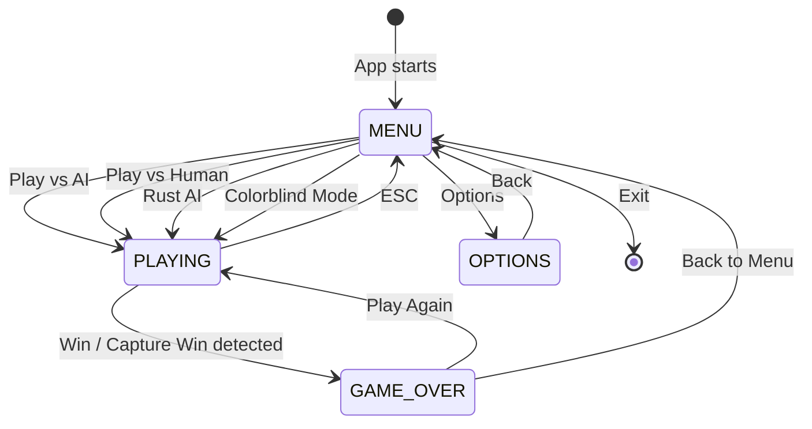
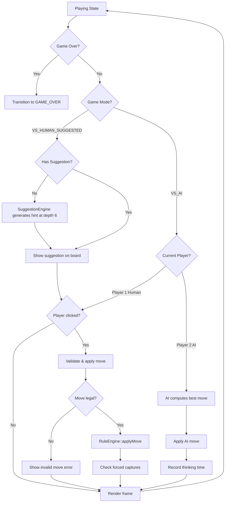
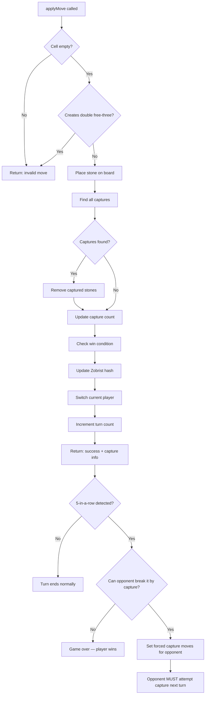
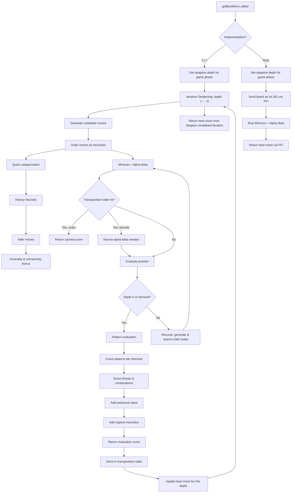
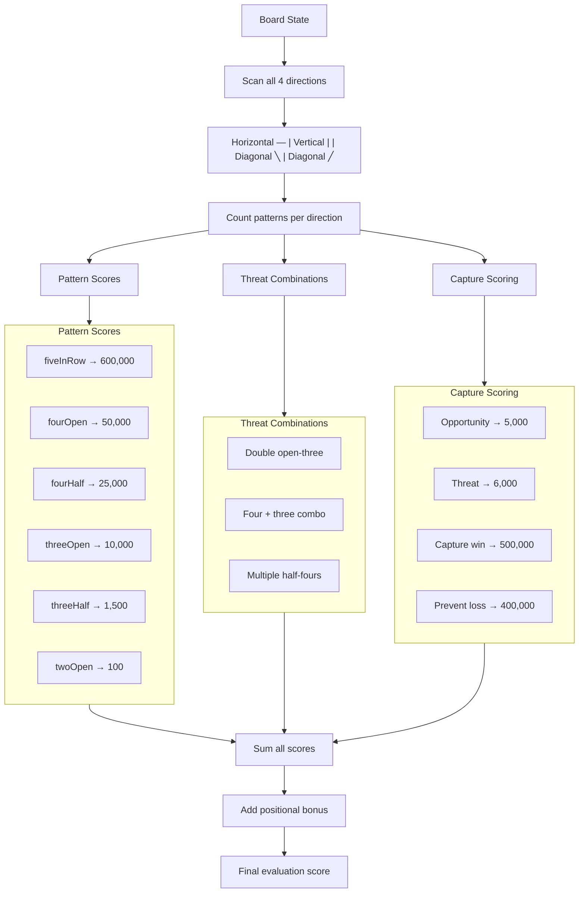
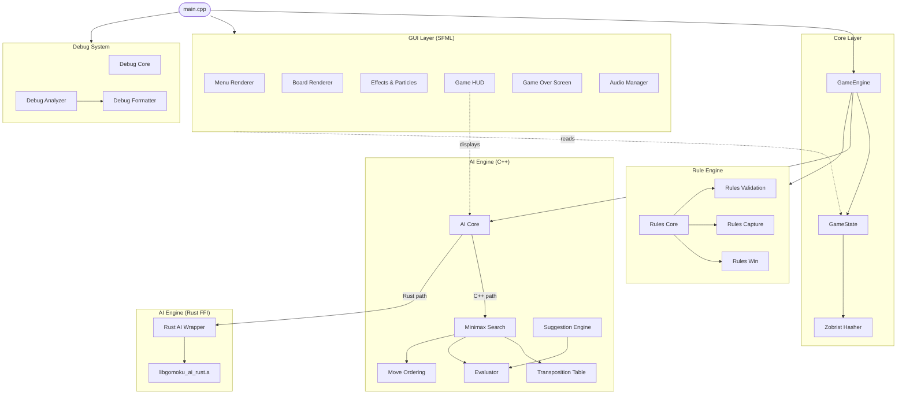
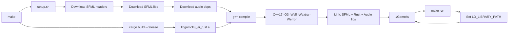

# Gomoku AI — Project Flow Diagrams

## 1. Application State Machine

The main game loop is a state machine with four states:

---

## 2. Game Loop — Playing State

---

## 3. Move Application Pipeline (RuleEngine)

---

## 4. AI Search Pipeline

---

## 5. Pattern Evaluation Breakdown

---

## 6. Module Architecture

---

## 7. Build Pipeline

